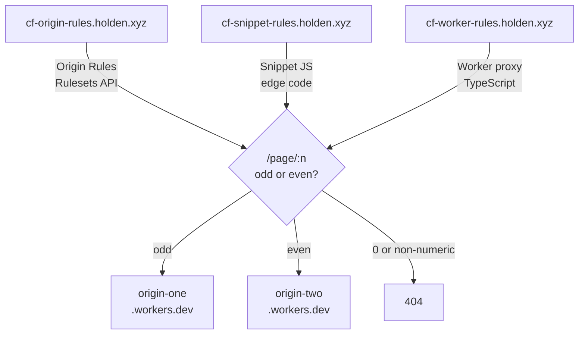

# cloudflare-routing-test

Compares three Cloudflare methods for path-based origin routing. Two origin Workers serve traffic; three subdomains of `holden.xyz` each demonstrate a different routing approach.

## Architecture



**Routing rule (all three methods):**

| Path | Response |
|------|----------|
| `/page/1`, `/page/3`, `/page/5`, … | `Hello from origin-one, request-id: <uuid>` |
| `/page/2`, `/page/4`, `/page/6`, … | `Hello from origin-two, request-id: <uuid>` |
| `/page/0`, `/page/abc`, `/`, `/*` | `404 Not Found` |

---

## Routing methods explained

### 1. Origin Rules (`cf-origin-rules.holden.xyz`)

Cloudflare's [Origin Rules](https://developers.cloudflare.com/rules/origin-rules/) use the Ruleset Engine to rewrite the destination host _before_ the request leaves Cloudflare's network. No code runs at the edge — the expression is evaluated by Cloudflare's built-in rule engine.

- Configured via the Rulesets API (`http_request_origin` phase)
- Two rules: one for odd paths (regex `^/page/[0-9]*[13579]$`), one for even
- Each rule sets `action_parameters.origin.host` and `host_header`
- Requires: proxied DNS, Business/Enterprise plan for regex expressions

### 2. Snippets (`cf-snippet-rules.holden.xyz`)

[Cloudflare Snippets](https://developers.cloudflare.com/rules/snippets/) are lightweight JavaScript that run on the edge before the request reaches the origin. Simpler than full Workers — no KV, Durable Objects, etc. — but sufficient for request rewriting.

- Uploaded via the Snippets API and linked to a rule expression
- The snippet rewrites the request URL to point at the correct origin
- Requires: proxied DNS, Snippets enabled on your plan

### 3. Worker Router (`cf-worker-rules.holden.xyz`)

A full [Cloudflare Worker](https://developers.cloudflare.com/workers/) acting as a reverse proxy. Receives every request, parses the path, and `fetch()`es the appropriate origin Worker.

- Most flexible — full JS/TS runtime
- Deployed via `wrangler deploy`
- Origin hostnames configured as `[vars]` in `wrangler.toml`

---

## Prerequisites

- [Cloudflare account](https://cloudflare.com) with `holden.xyz` zone
- `holden.xyz` nameservers pointed at Cloudflare
- Proxied DNS records for all three subdomains (see DNS Setup below)
- [pnpm](https://pnpm.io) — `npm install -g pnpm`
- [wrangler](https://developers.cloudflare.com/workers/wrangler/) — installed via workspace deps
- [jq](https://jqlang.github.io/jq/) — `brew install jq` (used by shell scripts)

---

## Setup

```bash
# 1. Clone and install dependencies
git clone <repo>
cd cloudflare-routing-test
pnpm install

# 2. Configure environment
cp .env.example .env
# Edit .env — fill in CLOUDFLARE_ZONE_ID, CLOUDFLARE_ACCOUNT_ID, CLOUDFLARE_API_TOKEN
```

### API token permissions

Create a token at [dash.cloudflare.com/profile/api-tokens](https://dash.cloudflare.com/profile/api-tokens) with:

- `Zone > Zone > Read`
- `Zone > Origin Rules > Edit`
- `Zone > Snippets > Edit`
- `Account > Workers Scripts > Edit`

---

## Deployment

### Step 1 — Deploy the origin workers

```bash
pnpm run deploy:origins
```

Wrangler will print the `*.workers.dev` URLs for each worker. Note them — you'll need them in the next steps.

### Step 2 — Update hostnames

Replace `<your-account>` placeholders with your actual workers.dev subdomain in:

- `workers/router/wrangler.toml` → `[vars]` section
- `scripts/deploy-origin-rules.sh` → `ORIGIN_ONE_HOST` / `ORIGIN_TWO_HOST`
- `scripts/deploy-snippet-rules.sh` → `ORIGIN_ONE_HOST` / `ORIGIN_TWO_HOST`

### Step 3 — Deploy the router worker

```bash
pnpm run deploy:router
```

### Step 4 — DNS setup

In the Cloudflare dashboard for `holden.xyz`, create three proxied CNAME records:

| Name | Target | Proxy |
|------|--------|-------|
| `cf-worker-rules` | `cf-worker-router.<your-account>.workers.dev` | Proxied |
| `cf-origin-rules` | any placeholder origin (e.g. `origin-one.<your-account>.workers.dev`) | Proxied |
| `cf-snippet-rules` | any placeholder origin (e.g. `origin-one.<your-account>.workers.dev`) | Proxied |

> For `cf-worker-rules`, you can alternatively add a [Worker Route](https://developers.cloudflare.com/workers/configuration/routing/routes/) pointing `cf-worker-rules.holden.xyz/*` at `cf-worker-router`.

### Step 5 — Apply Origin Rules

```bash
./scripts/deploy-origin-rules.sh
```

### Step 6 — Apply Snippet Rules

```bash
./scripts/deploy-snippet-rules.sh
```

---

## Testing

```bash
# Worker router
curl https://cf-worker-rules.holden.xyz/page/1   # Hello from origin-one, request-id: ...
curl https://cf-worker-rules.holden.xyz/page/2   # Hello from origin-two, request-id: ...
curl https://cf-worker-rules.holden.xyz/page/0   # 404
curl https://cf-worker-rules.holden.xyz/         # 404

# Origin Rules
curl https://cf-origin-rules.holden.xyz/page/3   # Hello from origin-one, request-id: ...
curl https://cf-origin-rules.holden.xyz/page/4   # Hello from origin-two, request-id: ...

# Snippets
curl https://cf-snippet-rules.holden.xyz/page/5  # Hello from origin-one, request-id: ...
curl https://cf-snippet-rules.holden.xyz/page/6  # Hello from origin-two, request-id: ...
```

---

## Local development

```bash
# Test an origin worker locally
pnpm --filter origin-one run dev
curl http://localhost:8787/page/1

# Test the router locally (set env vars first or use .dev.vars)
pnpm --filter cf-worker-router run dev
curl http://localhost:8787/page/2
```

For local router dev, create `workers/router/.dev.vars`:

```
ORIGIN_ONE_HOST=origin-one.<your-account>.workers.dev
ORIGIN_TWO_HOST=origin-two.<your-account>.workers.dev
```
